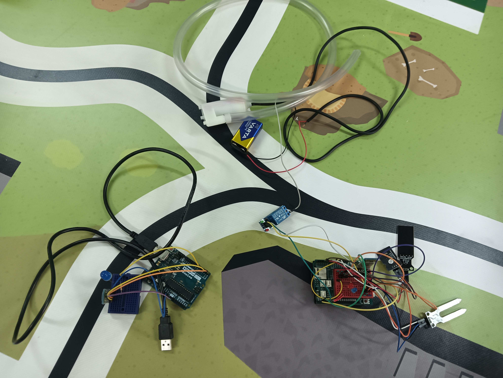

# Diseño3D 

## Cual es el objetivo

- El proyecto trata sobre diseñar en 3D un nuevo diseño para el invernadero como distribución de pilares y suelo  cuales se dividieron en partes para cada integrante de clase teniendo pilares y suelos distintos para cuando  se unan asi formar una estructura totalmente estable y autónoma que se pueda hasta levantar sin descomponerse
  
  ## Pilares y vigas

 - El  inicio del  proyecto fue con los pilares cuales se mandó hacer automáticamente por la falta de asistencia del profesorado los pilares y  vigas pueden tener o una "salida" o una "entrada" o varias normalmente 2 o hasta 4. Para que así los pilares y vigas estén unidos y estables y no se caigan ya que se conectan unos con otros formando como un caparazón, se mandaron a hacer 2 por cada persona
 - 
 

- Los pilares y vigas tienen unas medidas exacta de largo y ancho si tiene salidas igual que tienen una medidas exactas las entradas añadiendo centímetros para que así todos los integrantes del proyecto no tengan medidas desiguales y deban de no solo imprimir hacer un pilar o viga nuevo.

  ## Suelo

- El suelo es muy parecido a los pilares también siendo  distribuido entre alumnos y con entradas y salidas solo que con distintas medidas y en sus funciones el suelo esta enumerados por letras y números

 
 
- Es suelo debe de tener un espacio para que los pilares encajen y no se descoloquen permitiendo una mayor estabilidad y también espacios para que otros suelos encajen en él haciendo que sea menos probable el descolocamiento. Por ejemplo aqui una imagen del todo el proyecto para enseñar como estan los suelos y pilares y vigas

   

- Cuando el diseño 3D está preparado y se imprima recordando que número tiene asignado se conecta con los pilares y otros suelos

  

  ## Final del proyecto

  - Al juntar las piezas y los suelos formando la estructura del diseño 3D del invernadero debe de quedar una estructura perfectamente concluyendo como un rectángulo y así una estructura totalmente estable para el  invernadero.
 
    

# Montaje

##  Problema y objetivo del programa implementado a nuestro invernadero

- El problema es la necesidad de renovación del invernadero y de como adaptarlo más a la tecnologia y que sea casi automativco para que no necesite tanta mano humana durante su función para que asi nuestro objetivo sea mejorar la calidad de alimentos organicos y cumplir los objetivos de la agenda 20 30. Por  eso despues de montar la base  se pondra el programa del invernadero. Cual es un montaje que te avisa si hace poco/mucha temperatura y agua y riega automaticamente las plantas con varios sensonres, siendo casi totalmente autonomo para cumplir el objetivo de elinvernadero automatico.
 

## ¿De que esta compuesto?

- El programa esta compuesto de el cableado, un sensor de agua, un sensor de temperatura, un sensor de humedad, un relé, una bomba de agua, una bateria, una resistencia, dos diodos LED y dos modulos bluetooth

## ¿Como funciona el hardware?

- Comenzamos explicando el funcionamiento de los diodos LED cuales son encenderse y apagarse como una luz itermitente dependiendo de si detecta alta/baja temperatura o agua son dos para diferenciar cual es cual de aviso añadiendo que los modulos bluetooth tambien recibira la señal de esos diodos para encender otro diodos a distancia para asi mostrarlo más comodamente, un diodo de maestro y otro de esclavo. Despues estalos sensores, el de temperatura es para detectar la temperatura de las plantas en el invernadero para regar o no, ya que si hace mucho calor no es recomendable. El sensor de humedad es casi lo mismo que el de temperatura solo que si detecta poca humedad mandar una señal para regar las plantas, y el sensor de agua es para detectar el nivel de agua que hay en el recipiente y dar aviso si hayq que rellenarlo o no. El relé es para cuando el recibe una señal de encender la bomba como un itermitente con la suficiente alimentaci.on de la bateria.

   

## ¿Como es el programa del maestro?

CÓDIGO MAESTRO:

#include <SoftwareSerial.h>                                                      Incluye el objeto variable "miBT" haciendole referenca a softwareserial para
SoftwareSerial miBT (10,11);                                                     hacerle saber que es un bluetooth

// Variables sensor temperatura
int pinsensortemperatura = A2;                                                   int crea la variable de la temperatura cual es el A2 y tamben la variable de su 
int entradatemperatura;                                                           entrada
float temperatura; //Datos temperatura

// Pines salida
int led = 5; //LED rojo                                                           int del led rojo cual su salida es 5
int rele = 2; // Relé                                                             int del relé cual su salida es 2
int ledagua=6; //LED azul                                                         int de led azul cual su salida es 6

// Variables sensor humedad
int pinsensorhumedad = A0;                                                       La variables de sensor de humedad que su salida es el A0 in sy variable de entrada
int entradahumedad;
int humedad; //Datos humedad

// Variables sensor nivel de agua
int pinsensoragua=A1;                                                           
int agua; //Datos nivel agua

  La vaiable del sensor de nivel de agua cual esA1 y su variable de entrada

void setup() {                                                                  
Serial.begin(9600);
miBT.begin(9600);                                                                 
pinMode(ledagua,OUTPUT);
pinMode (led, OUTPUT);
pinMode (rele, OUTPUT);

}

 Activa el serial begin y el miBT para leer lainformacion de las entradas
 tambien  los pinMode en output paa que esten listos para recibir información

void loop() {
  entradaagua = analogRead(pinsensoragua);                                    
  agua = map(entradaagua, 0, 1023, 0, 100);                                  
  //Serial.print ("Nivel agua: ");  Serial.print(agua); Serial.println(" %");    
    delay(20);

Actua como lectura analogica de la información que recibe el porcentaje de agua
 en el recipiente y se lo configura con map para que sea de su maximo a 0 a 100
 al panel de control, relé y LEDS termnando con un delay de 20 milisegundos

 
  entradatemperatura = analogRead(pinsensortemperatura);                                                                                                     
  temperatura=(entradatemperatura* 50.0 / 1024.0);                           
  //Serial.print("Temperatura: "); Serial.print (temperatura); Serial.println(" ºC");                                                            
  delay(20);

 Hace otra lectura analogica ajustando su entrada de 50/1024 grados celsius con una
 calculo sin Map y envia
  los datos de entrada al panel de control, relé y LEDS terminando con otro delay de 
  20 milisegundos
  
 
  entradahumedad = analogRead(pinsensorhumedad);                             
  humedad=map(entradahumedad, 0, 1023, 0, 100);                              
  //Serial.print("Valor humedad relativa: "); Serial.print (humedad); Serial.println(" %");    
  delay (20);
  //miBT.print(agua);

  Hace otralectura analogica de la entrada del sensor pasando su limites de 0 a 1023 a
   0 a 100  con map siendo un valor elatvo pasando su entrada al panel de control, relé 
  y LEDS terminando con un delay de 20

  
 /*A TENER EN CUENTA:
    - La programación del relé está funcionado al revés para hacer que funcione correctamente.
 */

 //Nivel de agua bajo, paramos todo y conectamos LED azul
  if (agua <= 30){
    digitalWrite(ledagua, HIGH);
    miBT.write(1);
    digitalWrite(led, LOW);
    digitalWrite(rele, HIGH);

    

if dice que si el nivel de agua es menor a 30% la lectura digital i el miBT envia esa información a led que lo apaga y al relé que lo apaga también

   
  }
  //Nivel de agua óptimo, paramos LED azul y vemos si debemos regar
  if (agua > 30){
    digitalWrite(ledagua, LOW);
    miBT.write(2);
    //Si la humedad es baja, podemos regar pero....  
    if (humedad <= 50){
        //Si la temperatura es alta paramos el relé y activamos el LED rojo de advertencia
        if (temperatura >= 50){
          digitalWrite (led, HIGH);
          miBT.write(3);
          digitalWrite (rele, HIGH);
        }

   if dice que si el agua el mayor de 30% apagamos led azul pero if humedad y temperatura es mayor de 50% el digital write y miBT enviara la informacion para         encedner led rojo y apagar relé  

        
        //Si la temperatura es baja entonces regamos (LED rojo apagado y activamos el relé)
        if (temperatura < 50){
          digitalWrite (led, LOW);
          miBT.write(5);
          digitalWrite (rele, LOW);
        }
    

    if temperatura es menor de 50% digitalwrite y miBt  apaga el led rojo y Enciende el relé
    

  
    
    //Si la humedad es alta no regamos ni damos señal de advertencia
    if (humedad > 50){
      digitalWrite (led, LOW);
      miBT.write(4);
      digitalWrite (rele, HIGH);

    

  
 
  delay (20);
}

if de humedad es mayor a 50% sin nada más todos los leds se apagan por el digital write y el relé tamibenterminando con un delay de 20 milisegundos

   

  
  
## ¿Como es el programa del esclavo?

## ¿Como se configura los modulos bluetooth?
