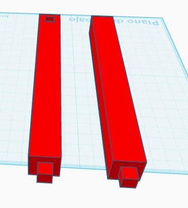
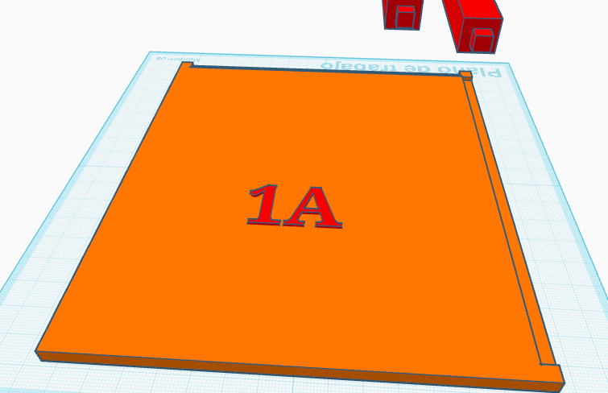
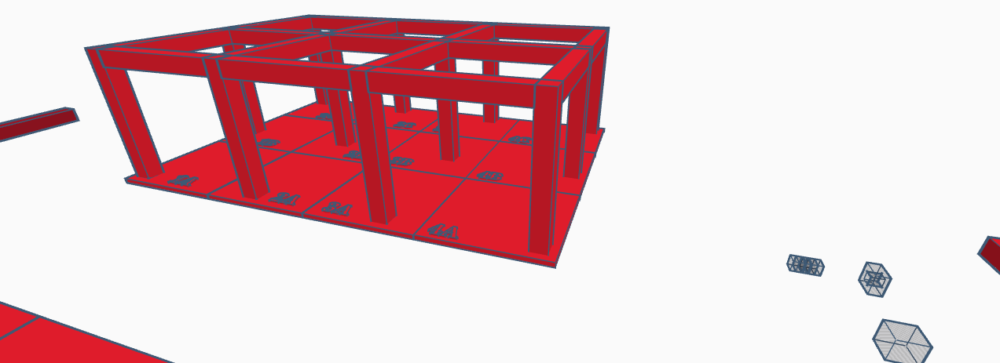
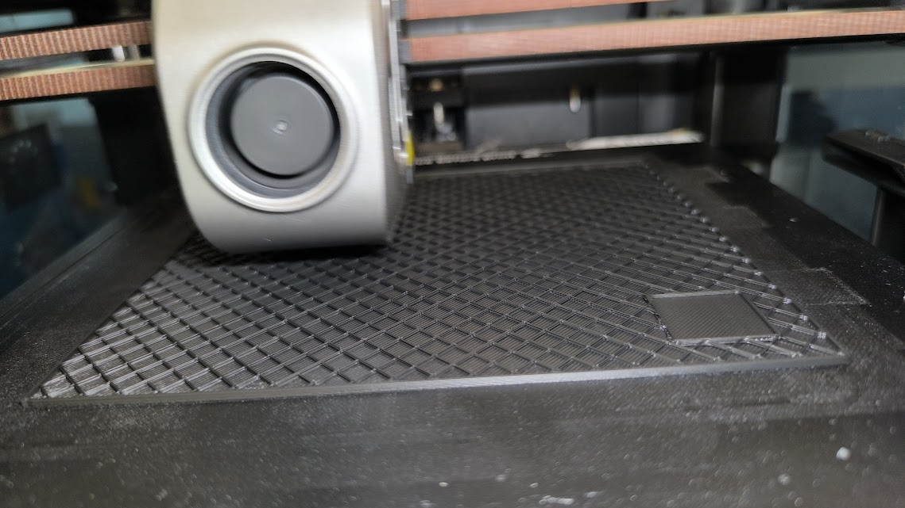
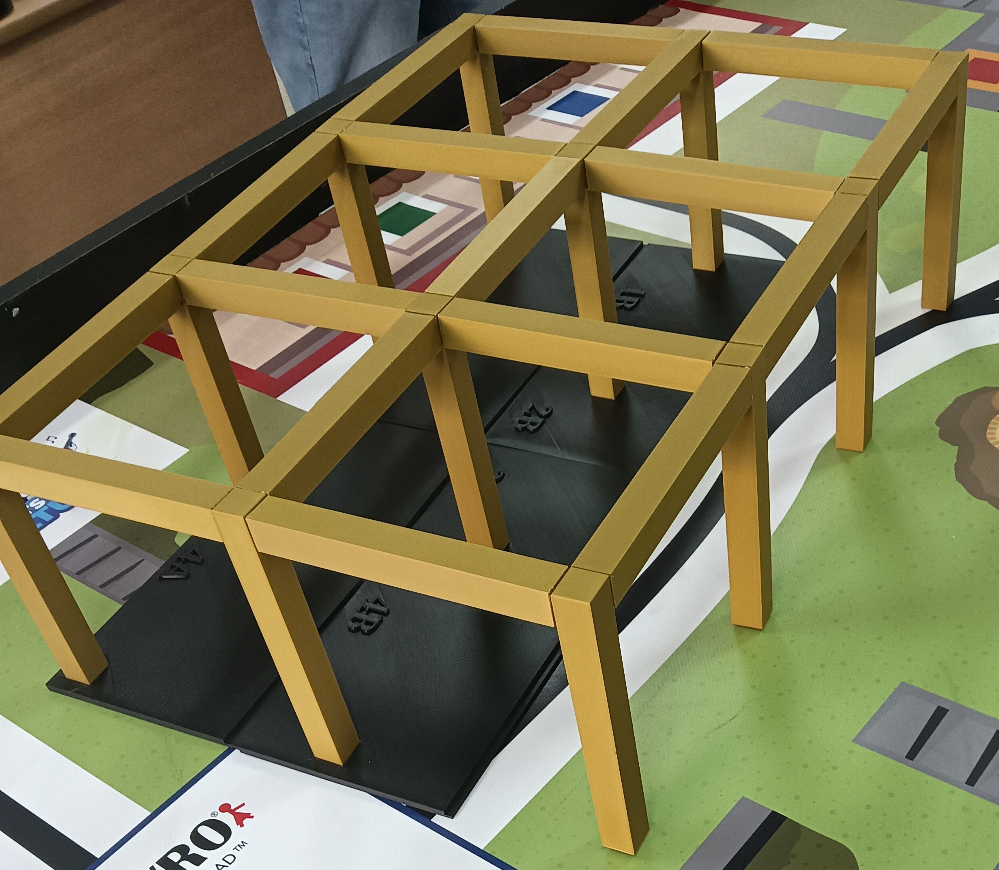
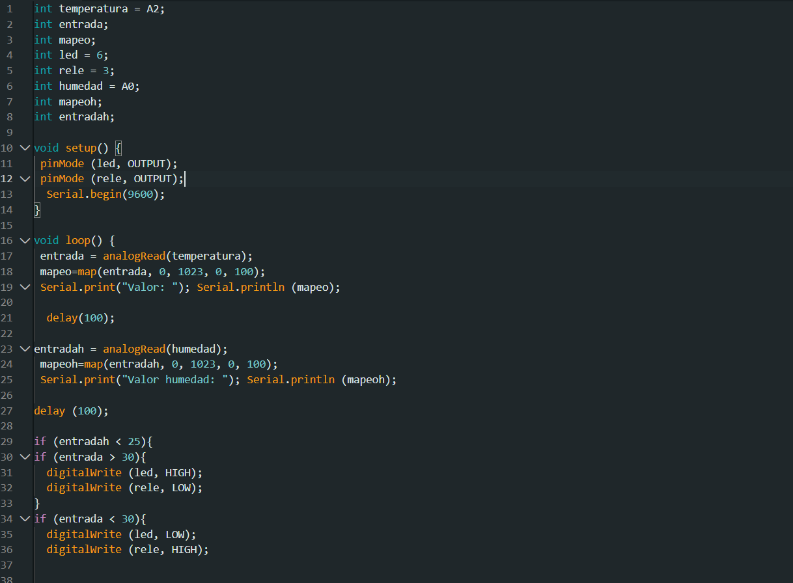

# Diseño3D 

## Cual es el objetivo

- El proyecto trata sobre diseñar en 3D un nuevo diseño para el invernadero como distribución de pilares y suelo  cuales se dividieron en partes para cada integrante de clase teniendo pilares y suelos distintos para cuando  se unan asi formar una estructura totalmente estable y autónoma que se pueda hasta levantar sin descomponerse
  
  ## Pilares y vigas

 - El  inicio del  proyecto fue con los pilares cuales se mandó hacer automáticamente por la falta de asistencia del profesorado los pilares y  vigas pueden tener o una "salida" o una "entrada" o varias normalmente 2 o hasta 4. Para que así los pilares y vigas estén unidos y estables y no se caigan ya que se conectan unos con otros formando como un caparazón, se mandaron a hacer 2 por cada persona
 - 
 

- Los pilares y vigas tienen unas medidas exacta de largo y ancho si tiene salidas igual que tienen una medidas exactas las entradas añadiendo centímetros para que así todos los integrantes del proyecto no tengan medidas desiguales y deban de no solo imprimir hacer un pilar o viga nuevo.

  ## Suelo

- El suelo es muy parecido a los pilares también siendo  distribuido entre alumnos y con entradas y salidas solo que con distintas medidas y en sus funciones el suelo esta enumerados por letras y números

 
 
- Es suelo debe de tener un espacio para que los pilares encajen y no se descoloquen permitiendo una mayor estabilidad y también espacios para que otros suelos encajen en él haciendo que sea menos probable el descolocamiento. Por ejemplo aqui una imagen del todo el proyecto para enseñar como estan los suelos y pilares y vigas

   

- Cuando el diseño 3D está preparado y se imprima recordando que número tiene asignado se conecta con los pilares y otros suelos

  

  ## Final del proyecto

  - Al juntar las piezas y los suelos formando la estructura del diseño 3D del invernadero debe de quedar una estructura perfectamente concluyendo como un rectángulo y así una estructura totalmente estable para el  invernadero.
 
    

## Objetivo del programa implementado a nuestro invernadero

- Despues de montar la base se pondra el programa del invernadero. Cual es un montaje que te avisa si hace poco/mucha temperatura y agua y riega automaticamente las plantas con varios sensonres, siendo casi totalmente autonomo para cumplir el objetivo de elinvernadero automatico.
 

## ¿De que esta compuesto?

- El programa esta compuesto de el cableado, un sensor de agua, un sensor de temperatura, un sensor de humedad, un relé, una bomba de agua, una bateria, una resistencia y dos diodos LED.

## ¿Como funcuona el programa?

- Comenzamos explicando el funcionamiento de los diodos LED cuales son encenderse y apagarse como una luz itermitente dependiendo de si detecta alta/baja temperatura o agua son dos para diferenciar cual es cual de aviso. Despues estalos sensores, el de temperatura es para detectar la temperatura de las plantas en el invernadero para regar o no, ya que si hace mucho calor no es recomendable. El sensor de humedad es casi lo mismo que el de temperatura solo que si detecta poca humedad mandar una señal para regar las plantas, y el sensor de agua es para detectar el nivel de agua que hay en el recipiente y dar aviso si hayq que rellenarlo o no. El relé es para cuando el recibe una señal de encender la bomba como un itermitente con la suficiente alimentaci.on de la bateria.

## ¿Como es el programa?

- El programa funciona primero creando las variables que son los sensores, Leds y el relé aparte de incluir mapeoh y entrada.
  El relé y Led se programan igual con su Pinmode desactivado en void setup al inicio cuando recibe una señal de un sensor con el DigitalWrite hace una acción cual las dos es actuar como un intermitente solo que la led es apagarse y encenderse continuamente y el relé es activar y desactivar la bomba continuamnete en void loop. Los sensores todos estan programados casi igual hya que en si es como deberia empezar en void setup el digital write activado para que despues en void loop el analogread este atento los tres sensores para que el mapeoh (menos el sensor de temperatura que no tiene mapeoh y tiene otro codigo aahí) y el serial print determinen los valores que detecta los sensores para asi saber si enviar y mandar un aviso a los leds o relé y mosntrarnos los datos con digital write con un delay de 100 milisegundos. La bomba solo se activa y desactiva cuando el relé se lo ordene concluyendo con el programa. 

   
